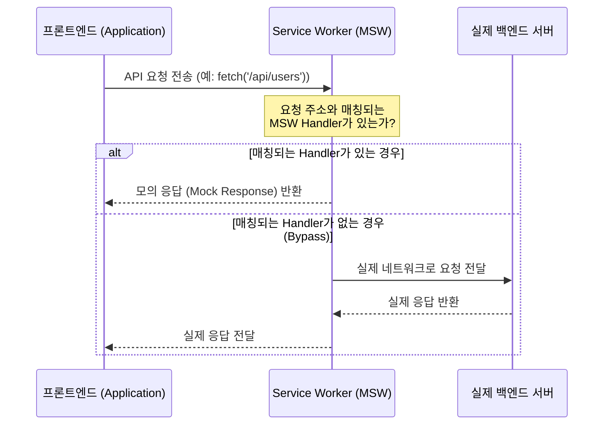

프로젝트를 진행하다 보면 기획과 디자인, API 명세까지는 완료되었지만, 정작 백엔드 API 개발이 완료되지 않아 프론트엔드 개발이 지연되는 상황을 마주하곤 합니다. API가 완성될 때까지 기다리기에는 전체 개발 일정이 빠듯하고, 그렇다고 코드에 가짜 데이터를 하드코딩해 두는 것은 나중에 실제 서버와 연동할 때 많은 코드를 다시 수정해야 하는 리스크가 있었습니다.

당시 물리 기기 제어나 하드웨어 스펙은 프론트엔드 개발과 직접적인 연관이 없었기 때문에, 오직 백엔드 API의 완성 여부가 전체 개발 흐름을 좌우하는 상황이었습니다. 백엔드 개발이 진행되는 동안 프론트엔드 팀이 멈추지 않고 미리 화면과 비즈니스 로직을 온전히 개발하기 위해 **MSW(Mock Service Worker)**를 도입했습니다.

### API 완성 전에 프론트엔드가 개발을 이어가는 세 가지 선택지

API가 준비되지 않았을 때 프론트엔드 개발자가 택할 수 있는 세 가지 방법과 각각의 예시 코드입니다.

#### 1. 화면 코드 내부에 가짜 데이터 하드코딩하기

구현은 가장 간단하지만, 컴포넌트 내부에 목업 데이터를 두고 개발하므로 나중에 실서버와 연동할 때 컴포넌트 코드의 비즈니스 로직을 대대적으로 뜯어고쳐야 합니다.

```javascript
// UserList.jsx
import React, { useState, useEffect } from "react";

// ❌ 화면 파일 내부에 가짜 데이터를 강하게 결합시킴
const mockUsers = [
  { id: 1, name: "김철수" },
  { id: 2, name: "이영희" },
];

export function UserList() {
  const [users, setUsers] = useState([]);

  useEffect(() => {
    // API 호출 대신 가짜 데이터 주입
    setUsers(mockUsers);

    /* 
      ⚠️ 실제 API 연동 시 아래 코드로 교체해야 하며, 
         위의 mockUsers 선언부를 찾아서 지워야 하는 번거로움이 있습니다.
      fetch('/api/users')
        .then(res => res.json())
        .then(data => setUsers(data));
    */
  }, []);

  return (
    <ul>
      {users.map((user) => (
        <li key={user.id}>{user.name}</li>
      ))}
    </ul>
  );
}
```

#### 2. 별도의 Mock 서버(Express 등) 구축하기

네트워크를 통해 실제 HTTP 요청을 보내는 방식입니다. 코드는 깔끔해지지만 환경에 따라 API Origin을 스위칭하는 환경변수 설정이 복잡해지고, 별도의 서버 프로세스를 관리해야 하는 비용이 듭니다.

```javascript
// server.js
// ⚠️ 별도의 Express mock 서버 실행 필요
const express = require("express");
const app = express();

app.get("/api/users", (req, res) => {
  res.json([
    { id: 1, name: "김철수" },
    { id: 2, name: "이영희" },
  ]);
});
app.listen(4000);

// UserList.jsx
// ⚠️ 로컬 Mock 서버와 실서버 간 엔드포인트 분기 로직이 코드에 남게 됩니다.
const API_URL =
  process.env.NODE_ENV === "development"
    ? "http://localhost:4000"
    : "https://api.real-server.com";

useEffect(() => {
  fetch(`${API_URL}/api/users`)
    .then((res) => res.json())
    .then((data) => setUsers(data));
}, []);
```

#### 3. MSW(Mock Service Worker) 활용하기

브라우저 API인 서비스 워커를 활용하여 프런트엔드 소스 코드는 실제 배포되었을 때와 완전히 동일하게 유지하면서, 개발 단계에서만 요청을 가로채 응답을 주는 가장 깔끔한 방식입니다.

```javascript
// 🟢 mocks/handlers.js (MSW 핸들러 정의)
import { http, HttpResponse } from "msw";

export const handlers = [
  http.get("/api/users", () => {
    return HttpResponse.json([
      { id: 1, name: "김철수" },
      { id: 2, name: "이영희" },
    ]);
  }),
];

// UserList.jsx
// ✨ 실서버가 완성되어도 프론트엔드 컴포넌트 코드는 한 줄도 수정할 필요가 없습니다.
useEffect(() => {
  fetch("/api/users")
    .then((res) => res.json())
    .then((data) => setUsers(data));
}, []);
```

---

### 서비스 워커(Service Worker)란 무엇인가요?

MSW를 깊게 이해하기 위해서는 먼저 **서비스 워커(Service Worker)**의 개념을 알아둘 필요가 있습니다.

서비스 워커는 브라우저가 백그라운드에서 실행하는 웹앱의 스크립트 파일로, 웹페이지와는 완전히 분리된 독자적인 생명주기를 갖습니다. 주요 특징은 다음과 같습니다.

- **네트워크 프록시 역할**: 브라우저로부터 발생하는 모든 네트워크 요청을 가로채서(Intercept) 수정하거나 대체 응답을 반환할 수 있는 브라우저 내부의 **중간 검문소** 역할을 수행합니다.
- **백그라운드 스레드 실행**: UI 렌더링을 담당하는 메인 스레드와 별개인 백그라운드 스레드에서 작동하므로, 서비스 워커의 로직이 페이지 렌더링 성능을 저하시키지 않습니다.
- **기본 제약 사항**: 웹페이지의 DOM 구조에 직접 접근할 수 없으며, 보안상 반드시 HTTPS 프로토콜 환경(또는 로컬 개발을 위한 `localhost`)에서만 활성화됩니다.

본래 오프라인 캐싱, 백그라운드 데이터 동기화, 푸시 알림 등 PWA(Progressive Web App) 핵심 기능 구현을 위해 표준화된 기술이지만, MSW는 바로 이 **네트워크 요청 가로채기(Intercept)** 기능을 테스트 및 Mock API 개발의 용도로도 자주 사용되는 도구입니다.

---

### MSW의 동작 원리

MSW는 어떻게 프론트엔드 코드 수정 없이 네트워크 요청을 가로채 처리할 수 있을까요? 바로 이 브라우저 표준 기술인 **Service Worker** 덕분입니다.



1. **서비스 워커 등록**: 애플리케이션 초기 구동 시 MSW 스크립트가 브라우저에 서비스 워커를 등록합니다.
2. **요청 가로채기(Intercept)**: 웹앱에서 `fetch`나 `axios` 등을 통해 네트워크 요청을 보내면, 브라우저가 이 요청을 바로 인터넷으로 보내지 않고 먼저 등록된 서비스 워커로 전달합니다.
3. **핸들러 매칭**: 서비스 워커는 요청이 오면 MSW에 작성한 `handlers.js` 규칙과 비교합니다.
   - **일치하는 모의 API가 있을 때**: 실제 백엔드 서버에 요청을 보내지 않고, MSW가 정의한 모의 응답(Mock Response)을 즉시 브라우저로 리턴합니다.
   - **일치하는 모의 API가 없을 때(Bypass)**: 정상적으로 실제 네트워크망을 타게 하여 백엔드 서버 혹은 외부 CDN 등 원래 목적지로 요청이 흘러가게 둡니다.

---

### MSW 등록 및 활성화 방법

프로젝트에 MSW를 직접 설정하고 구동하는 과정은 크게 세 단계로 나뉩니다.

#### 1. 서비스 워커 스크립트 파일 생성

MSW가 브라우저 요청을 가로챌 수 있도록 돕는 서비스 워커 파일(`mockServiceWorker.js`)을 프로젝트의public 디렉토리에 생성합니다.

```bash
npx msw init public/ --save
```

_(CRA나 Vite 등 사용하는 프론트엔드 빌드 도구 설정에 맞춰 정적 폴더 경로(`public/` 등)를 지정해 주어야 합니다.)_

#### 2. 브라우저 워커 생성 (`mocks/browser.js`)

정의한 핸들러들을 가져와 브라우저 환경에서 동작할 MSW 워커 인스턴스를 초기화합니다.

```javascript
// src/mocks/browser.js
import { setupWorker } from "msw/browser";
import { handlers } from "./handlers";

// 등록한 mock 핸들러들로 워커를 세팅합니다.
export const worker = setupWorker(...handlers);
```

#### 3. 애플리케이션 진입점 등록 (`main.js` 또는 `index.js`)

애플리케이션이 실행될 때, 개발 환경(`development`)에서만 MSW 서비스 워커가 활성화된 이후 앱을 렌더링하도록 작성합니다.

```javascript
// src/main.js (또는 src/index.js)
import React from "react";
import ReactDOM from "react-dom/client";
import App from "./App";

async function enableMocking() {
  // 실서버 배포 등 개발 환경이 아닐 때는 가로채지 않습니다.
  if (process.env.NODE_ENV !== "development") {
    return;
  }

  const { worker } = await import("./mocks/browser");

  return worker.start({
    onUnhandledRequest: "bypass",
  });
}

enableMocking().then(() => {
  ReactDOM.createRoot(document.getElementById("root")).render(
    <React.StrictMode>
      <App />
    </React.StrictMode>,
  );
});
```

---

### MSW 도입으로 얻은 이점

- **코드 수정 없는 실서버 연동**: 개발 환경에서는 MSW가 요청을 중간에 가로채서 응답을 주고, 실서버가 완성된 후에는 MSW 활성화 코드만 꺼두면 실제 API와 바로 붙일 수 있었습니다.
- **대기 시간 없는 흐름**: 백엔드가 API를 개발하고 있는 동안 프론트엔드도 독립적으로 개발을 마칠 수 있어, 전체 개발 일정을 약 2주가량 앞당길 수 있었습니다.
