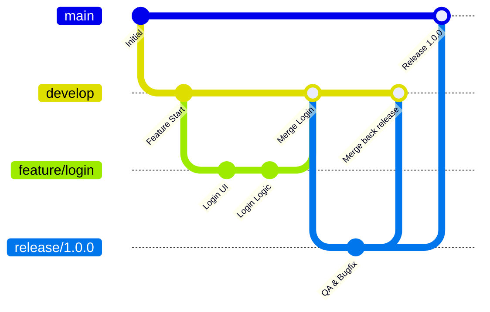

여러 명의 개발자가 하나의 리포지토리에서 동시에 작업하다 보면, 작업한 코드가 겹쳐 덮어쓰기가 발생하거나 검증되지 않은 기능이 운영 서버에 배포되는 등 협업 프로세스의 부재로 인한 문제가 자주 일어납니다.

이러한 비효율을 해결하고 안전한 배포 단계를 확보하기 위해, 팀의 규모와 개발 속도에 맞춰 **Git Flow 브랜치 전략**을 정의하고 도입하게 되었습니다.

---

### 왜 Git Flow였을까요?

저희 팀이 도입을 결정하기 전, 업계에서 널리 쓰이는 대표적인 브랜치 전략들을 비교하고 팀에 가장 부합하는 모델을 찾았습니다.

#### 1. GitHub Flow

- **이름의 유래/의미**: GitHub 사가 2011년경 자사의 협업 방식과 신속한 배포 철학을 바탕으로 고안해 발표한 데서 기원하며, Pull Request 중심의 신속하고 막힘없는 흐름(Flow)을 뜻합니다.
- **설명**: `main` 브랜치 하나와 수명이 짧은 기능별 `feature` 브랜치만 활용하는 매우 단순한 구조입니다. 기능 개발이 완료되면 `main`에 병합하고 즉시 배포합니다.
- **장점**: 브랜치 관리에 따르는 오버헤드가 거의 없고, 피드백 반영 및 배포 속도가 극도로 빠릅니다.
- **단점**: 개발(Dev), 검증(Staging), 운영(Prod) 등 여러 배포 인프라가 격리되어 있고, 환경별 빌드를 매핑하여 순차적으로 QA를 수행해야 하는 경우 관리가 까다롭습니다.
- **적합한 사용처**: 단일 배포 환경을 가진 경량 웹 서비스, 빈번하고 즉각적인 릴리스가 필요한 소규모 스타트업 프로젝트.

#### 2. Trunk-based Development

- **이름의 유래/의미**: 나무의 '몸통'을 뜻하는 단어 'Trunk'에서 유래했습니다. 복잡하게 뻗어 나가는 나뭇가지(Feature Branches)들을 최소화하고, 하나의 두꺼운 나무 몸통(Main 브랜치)에 모든 개발자가 수시로 코드를 병합하는 방식을 비유합니다.
- **설명**: 모든 개발자가 단일 주 브랜치(`main` 또는 `trunk`)에 직접 커밋하거나, 하루 내에 머지되는 극도로 짧은 수명의 기능 브랜치만을 만들어 빠르게 코드를 통합(Merge)해나가는 방식입니다.
- **장점**: 대규모 변경 사항이 오래 격리되지 않아 머지 헬(Merge Hell)이 발생하지 않으며, 지속적 통합(CI)의 가치를 극대화합니다.
- **단점**: 코드가 늘 작동 가능한 상태로 주 브랜치에 들어가야 하므로, 촘촘한 테스트 자동화 인프라와 배포 후 기능을 제어할 수 있는 피처 플래그(Feature Flag) 관리 도구가 필수적으로 요구됩니다.
- **적합한 사용처**: 배포 자동화 및 QA 테스트 자동화가 탄탄하게 갖추어진 대형 테크 기업이나 제품 개발 그룹.

#### 3. Git Flow (우리가 선택한 전략)

- **이름의 유래/의미**: 2010년 Vincent Driessen이 제안한 브랜칭 모델로, Git이 제공하는 가볍고 유연한 브랜칭 능력을 시스템화하여 소스 코드의 개발부터 출시까지의 흐름(Flow)을 규칙화하고 제어한다는 의미를 담고 있습니다.
- **설명**: `main`, `develop`, `feature`, `release`, `hotfix` 등 목적별 다섯 가지 브랜치를 활용하여 개발, 검증, 운영 핫픽스 단계를 명확히 분리합니다.
- **장점**: 출시 예정 버전을 릴리스 브랜치(`release`)로 격리해 두고 품질을 높이는 QA 기간을 둘 수 있으므로 신규 기능 개발을 방해하지 않고도 배포 안정성을 유지할 수 있습니다.
- **단점**: 구조가 비교적 복잡하여 팀원 간 룰 준수에 대한 러닝 커브가 있고 브랜치 동기화에 필요한 관리 리소스가 듭니다.
- **적합한 사용처**: 정기 배포 일정(릴리스 사이클)이 정해져 있거나 여러 단계의 스테이징 환경 검증을 필수로 거치는 엔터프라이즈급 프로젝트.

당시 저희 프로젝트는 운영 서버에 패치를 적용하기 전 검증(Staging) 환경에서 내부 QA를 거쳐 안정적인 릴리스 버전을 빌드하는 품질 관리가 필수적이었습니다. 이에 따라 릴리스 안정성을 엄격하게 챙길 수 있는 **Git Flow**를 도입하기로 결정하였습니다.

---

### 브랜치 종류와 병합 순서

저희 팀은 표준 **Git Flow** 모델을 바탕으로 하되, 릴리스 주기에 맞춰 다음과 같이 브랜치 역할을 정의하여 협업 규칙을 수립했습니다.

1. **`main`**
   - 실제 운영 환경에 배포되는 가장 안정적인 최상위 브랜치입니다. 모든 커밋은 릴리스 태그(Tag)와 매핑됩니다.
2. **`develop`**
   - 다음 배포 버전의 신규 기능들이 머지되는 중심 개발 브랜치입니다.
   - 테스트 서버에 배포될 버전으 관리합니다.
3. **`feature/*`**
   - 개별 기능을 개발하는 브랜치입니다. `develop` 브랜치에서 분기하여 기능 개발이 끝나면 코드 리뷰를 거쳐 다시 `develop`으로 머지(PR)합니다.
4. **`release/v*`**
   - 배포를 준비하는 검증 브랜치입니다. `develop` 브랜치에서 분기하며, 이 브랜치에서는 오직 QA 과정에서 발견된 버그 수정(Bugfix)만 수행합니다. 안정화가 끝나면 `main`과 `develop` 브랜치 양쪽에 머지합니다.
   - 실서버에 배포할 버전을 명시합니다. (ex: release/v2023.05.15)
5. **`hotfix/*` (Emergency Patch)**
   - 운영 환경(`main`)에서 발생한 긴급 장애를 즉시 패치하기 위한 브랜치입니다. `main`에서 직접 분기하여 수정 후 `main`과 `develop` 브랜치 양쪽으로 다시 머지합니다.

---

### 협업 규칙

단순히 브랜치를 분리하는 것만으로는 문제가 해결되지 않았습니다. 실무에 협업 프로세스를 정착시키기 위해 네 가지 규칙을 정했습니다.

- **PR 템플릿 도입**: PR 작성 시 기능 설명, 테스트 체크리스트, 연관 이슈 번호 등을 명시하도록 강제하여 리뷰의 피로도를 줄입니다.
- **최소 1명 이상의 승인(Approve) 필수화**: 한 명이 독단적으로 병합하여 발생하는 빌드 에러를 막기 위해 최소 1명 이상의 승인자를 지정합니다.
- **Gitmoji**: 커밋 메시지의 헤더 부분에 이모지를 활용하여 기능 개발(✨), 버그 수정(🐛), 리팩토링(♻️) 등 작업의 의도를 시각적으로 명확히 표시함으로써 히스토리 파악 속도를 높입니다.
- **Rebase 금지**: 커밋 히스토리의 일관성을 유지하고 충돌 시 발생할 수 있는 혼선을 막기 위해 머지 방식은 일반적인 `Merge Commit` 방식으로 단일화했습니다.

### 결론

브랜치 모델이 정립된 후, 여러 개발자가 같은 코드를 동시에 건드리며 발생하던 충돌(Conflict) 발생 건수가 현저히 줄었습니다. 또한, 배포 준비를 위한 `release` 브랜치가 따로 격리됨으로써 신규 기능 개발을 멈추지 않고도 안정적으로 QA와 핫픽스를 병행할 수 있는 안정적인 개발 체계를 만들 수 있게 되었습니다.
