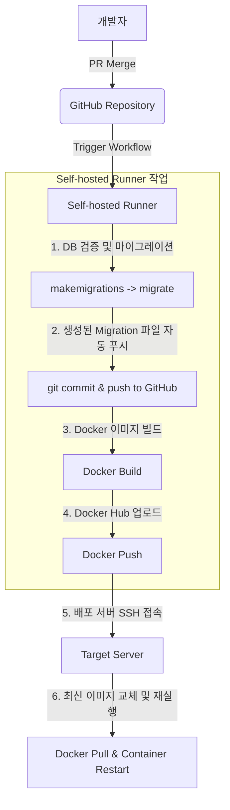

프로젝트 초기에는 로컬에서 빌드한 결과물을 FTP나 SSH를 통해 서버에 직접 업로드하는 **수동 배포** 방식을 흔히 사용합니다. 하지만 수동 배포는 개발자 로컬 환경의 차이, 배포 과정의 누락, 환경변수 설정 실수 등으로 인해 월 평균 5건이 넘는 배포 관련 휴먼 에러를 유발하곤 했습니다.

특히 저희 프로젝트는 **Django** 백엔드를 사용하고 있어, 데이터베이스 스키마 마이그레이션 파일이 개발자 간에 꼬여 배포 단계에서 오류가 발생해 서비스가 중단되는 고질적인 문제를 안고 있었습니다. 이러한 장애 요소를 제거하고 배포 안정성을 확보하기 위해 **GitHub Actions Self-hosted Runner**와 **Docker**를 중심으로 CI/CD 파이프라인을 전면 자동화했습니다.

---

### 기존 배포 및 데이터베이스 협업의 고통

과거 수동 배포 시절에는 빌드 피로도 외에도 데이터베이스 마이그레이션 관리가 가장 큰 난제였습니다.

1. **로컬 개발자 간의 마이그레이션 충돌**
   - 여러 개발자가 각자 로컬에서 기능 개발을 위해 `makemigrations`를 수행해 마이그레이션 파일(예: `0002_auto_...`)을 생성하고 Git에 올리면, 병합(Merge) 과정에서 의존성 트리가 꼬였습니다.
   - 이 상태로 서버 배포 시 마이그레이션 오류로 인해 서버 실행이 불가능해지는 장애가 자주 일어났습니다.
2. **배포 환경의 파편화 및 높은 리소스 비용**
   - 배포할 때마다 서버 환경 설정 파일을 일일이 확인해야 했고, 서버 메모리 등의 제약으로 퍼블릭 GitHub Runner에서 빌드할 때 성능 제한이 있었습니다.
3. **수동 컨테이너 교체 작업의 실수**
   - 서버에 접속해 컨테이너를 직접 내리고 새 이미지를 풀(Pull) 받아 다시 실행하는 모든 과정에 휴먼 에러 개입 여지가 많았습니다.

---

### CI/CD 배포 파이프라인 아키텍처

저희는 퍼블릭 러너의 빌드 제한 속도를 극복하기 위해 사내 인프라를 활용한 **Self-hosted Runner**를 등록하고, 이미지 배포를 안전하게 중개할 **Docker Hub**를 활용했습니다.

#### 1. 트리거 조건 분리

불필요한 배포 빌드 리소스를 낭비하지 않도록 명확한 브랜치 머지 시점에만 워크플로우가 동작하도록 설정했습니다.

- **개발/검증 환경 배포**: `feature/*` -> `develop` 브랜치 병합 시 작동
- **운영 환경 배포**: `release/*` -> `main` (또는 `master`) 브랜치 병합 시 작동

#### 2. 배포 시나리오 흐름

1. **GitHub Actions 트리거**: 지정 브랜치에 PR이 병합되면, 등록된 **Self-hosted Runner**가 감지해 작동을 시작합니다.
2. **도커 이미지 빌드 및 푸시**: 러너가 소스코드를 가져와 Docker 이미지를 생성한 뒤, 사내 **Docker Hub** 리포지토리에 업로드합니다.
3. **서버 컨테이너 교체**: 러너가 배포 대상 서버에 SSH로 접속해 최신 이미지를 다운(Pull)받고, 기존 컨테이너를 안전하게 새로운 컨테이너로 스위칭하여 재실행합니다.

---

### 핵심 문제: Django 마이그레이션

배포 실패의 주범이었던 Django 마이그레이션 꼬임 문제를 완전히 뿌리뽑기 위해 **마이그레이션 생성 권한을 사람이 아닌 배포 러너(Runner)에만 위임**하도록 했습니다.

#### 1. Git Push 금지 규칙

개발자가 로컬에서 생성한 마이그레이션 파일을 원격 저장소에 올릴 수 없도록 `.gitignore` 설정 및 린트 수준에서 차단하여, Git 상의 마이그레이션 파일이 충돌하는 경우를 물리적으로 예방했습니다.

#### 2. 배포 러너가 마이그레이션 자동 처리 및 커밋

실제 DB 스키마를 동기화하고 파일을 추적하는 작업은 오직 **Self-hosted Runner**가 배포 시점에 일괄 처리합니다.
이 방식을 도입한 이후, **Django 마이그레이션 충돌로 인한 배포 중단 문제는 단 한 건도 발생하지 않았습니다.**

---

### 개발자를 위한 로컬 스키마 싱크(Sync) 가이드

개발자가 로컬에서 새로운 모델 속성을 추가해 기능을 구현하려면 로컬에서도 마이그레이션 파일이 필요합니다. 깃에 푸시하지 않으면서도 로컬 스키마와 최신 `develop` 브랜치 스키마를 매끄럽게 유지하기 위해 아래와 같은 로컬 싱크 가이드를 정립했습니다.

1. **로컬 마이그레이션 폐기 및 되돌리기**
   - `develop` 브랜치로부터 최신 코드를 풀(Pull) 받기 전, 본인이 테스트를 위해 로컬에서 임의로 생성했던 마이그레이션 파일(Git에서 추적되지 않는 파일)을 모두 삭제하고 로컬 DB를 이전 상태로 되돌립니다.
2. **최신 develop 풀 받기**
   - 러너에 의해 안전하게 생성되어 Git에 커밋되어 올라온 공식 마이그레이션 파일이 포함된 최신 `develop` 코드를 받아옵니다.
3. **로컬 마이그레이션 재실행**
   - 새로 내려받은 공식 마이그레이션 파일로 로컬 DB에 `migrate`를 돌려, 팀 공동의 데이터베이스 구조 기준과 본인의 로컬 환경을 완전히 동기화합니다.

---

### 도입 후 결과

CI/CD 및 마이그레이션 파이프라인의 도입으로 개발 주기가 단축되고 휴먼 에러가 줄어들었습니다.

- **배포 장애 0건에 도전!!**: 가장 복잡하고 골치 아팠던 Django 스키마 충돌이 자동화 시스템 아래 관리되면서 관련 장애가 완벽히 해결되었습니다. (하지만, 아직 develop 배포 후 로컬 개발환경을 맞춰주는 작업을 자동화하는 과제가 남아있긴 합니다^^)
- **배포 시간 단축**: 무거운 Docker 이미지 빌드를 높은 하드웨어 사양의 Self-hosted Runner가 처리하고 컨테이너를 원클릭으로 교체함으로써, 배포 작업에 소요되는 평균 시간이 20분에서 5분 이내로 줄었습니다.
