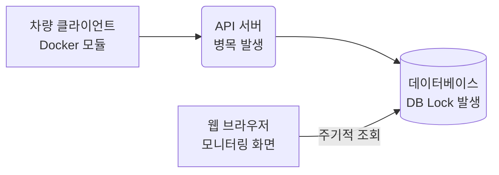
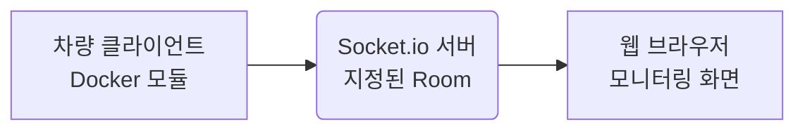

차량에 탑재된 소프트웨어 모듈들의 상태를 실시간으로 브라우저에 표시하는 시스템을 구축했습니다. 오늘은 기존의 주기적 Polling 방식을 웹소켓(Socket.io) 기반의 실시간 통신으로 전환하여, 데이터베이스 과부하를 해소하고 화면 동기화 지연 시간을 기존 2초에서 0.5초로 단축한 경험을 공유해보려고 합니다!

---

## 1. 배경: 자율주행 모듈과 원격 모니터링

실험용 차량에 설치되는 자율주행 소프트웨어는 기능별로 독립적인 도커(Docker) 컨테이너 단위로 실행됩니다. 경로를 계획하는 플래닝 모듈이나 차량 제어를 담당하는 컨트롤 모듈 등이 각각 가상 환경에서 개별적으로 작동하는 구조입니다.

이 모듈들이 실제로 움직이고 있는지 원격지에서 확인하기 위해 웹 브라우저 기반의 모니터링 화면을 개발했습니다. 화면의 정보 지연이 발생하면 오퍼레이터가 현재 차량의 상세 상태를 즉각 파악하기 어려워 모니터링의 신뢰도가 떨어지기 때문에, 실시간성을 확보하는 것이 최우선 과제였습니다.

---

## 2. 문제: 주기적 조회의 한계와 데이터베이스 부하

초기에는 구현이 단순한 요청-응답(HTTP API) 구조를 사용했습니다. 차량 내부 프로그램이 모듈 상태를 서버에 전송해 데이터베이스에 저장하면, 웹 브라우저가 주기적으로 서버에 요청을 보내 데이터베이스를 조회하여 화면을 갱신하는 방식이었습니다.

이러한 데이터베이스 경유 방식은 크게 두 가지 문제를 일으켰습니다.

첫째는 **데이터베이스의 물리적 부하**였습니다. 관제 화면을 실행하는 브라우저와 차량의 수가 늘어날수록 데이터베이스에 저장 쿼리와 조회 쿼리가 기하급수적으로 몰렸습니다. 이로 인해 데이터베이스 락(DB Lock)이 빈번하게 발생하여 모듈 상태 조회 외에 다른 API 요청들까지 느려지곤 했습니다.

둘째는 **화면의 동기화 지연**이었습니다. 웹 브라우저가 일정 주기마다 새 정보를 물어보는 구조이다 보니, 실제 차량에서 상태 변화가 일어난 뒤에 브라우저가 다음 주기에 이를 가져오기까지 지연 시간이 발생할 수밖에 없었습니다.

---

그림 1: 기존 Polling 통신 아키텍처. 기기 상태가 변할 때마다 매번 DB 쓰기/읽기 락이 중첩되는 병목이 존재합니다.

---

## 3. 해결을 위한 대안 검토: Redis vs SSE vs Socket.io

데이터베이스 부하를 줄이기 위해 여러 대안들을 검토했습니다.

| 대안 기술                    | 통신 방식                                    | 실시간성                     | 프로젝트 적합도 및 한계                                                                            |
| :--------------------------- | :------------------------------------------- | :--------------------------- | :------------------------------------------------------------------------------------------------- |
| **Redis (캐싱)**             | 단방향 조회 (Polling)                        | 낮음 (조회 주기에 의존)      | 데이터베이스 쿼리 부하는 줄일 수 있으나, 브라우저의 반복적인 요청과 화면 지연은 해결되지 않음.     |
| **SSE (Server-Sent Events)** | 단방향 푸시 (서버 &rarr; 브라우저)           | 높음 (실시간 수신)           | 차량 상태를 수신하는 것은 가능하지만, 오퍼레이터가 브라우저에서 차량으로 제어 명령을 보낼 수 없음. |
| **Socket.io (선택)**         | 양방향 소켓 (서버 &leftrightarrow; 브라우저) | 매우 높음 (양방향 즉시 전송) | 실시간 모니터링과 원격 제어 명령 송신을 모두 수용하며, 무선 연결이 끊겨도 자동으로 복구됨.         |

따라서 데이터베이스 부하를 없애고 안정적인 실시간 양방향 통로를 확보하기 위해 최종적으로 웹소켓(Socket.io)을 선택했습니다.

---

## 3.1. WebSocket vs Socket.i

실시간 통신을 도입할 때 흔히 혼동하는 개념이 **WebSocket(웹소켓)**과 **Socket.io**입니다. 이 둘은 실시간 통신을 가능하게 한다는 목적은 같지만, 동작 방식과 제공하는 기능 수준에서 명확한 차이가 있습니다.

- **WebSocket (프로토콜)**
  - HTML5 표준 기술로, TCP 연결 위에서 동작하는 양방향 통신 프로토콜(`ws://` 또는 `wss://`)입니다.
  - 아주 가볍고 오버헤드가 적은 것이 장점이지만, 연결이 끊겼을 때의 재연결 로직, 방(Room) 분할, 연결 실패 시 HTTP Polling으로의 Fallback 등 고수준의 기능을 개발자가 직접 밑바닥부터 구현해야 합니다.
- **Socket.io (라이브러리)**
  - 웹소켓을 기반으로 구축된 고수준 실시간 통신 라이브러리입니다. 본래 Node.js(JavaScript) 생태계에서 시작되었으나, 현재는 Python, Java, C++, Swift 등 다양한 언어의 공식/서드파티 클라이언트 라이브러리를 지원하여 서로 다른 플랫폼 간의 양방향 이벤트 통신을 쉽게 연결해 줍니다.
  - 단순히 웹소켓을 감싸는 역할에 그치지 않고, 웹소켓 연결이 불가능한 구형 브라우저 환경에서는 HTTP Long Polling으로 자동 전환하여 통신 연결을 보장하며, 자동 재연결(Auto Reconnect) 및 소켓 방(Room) 개념을 기본적으로 제공합니다.
  - 본 프로젝트에서는 불안정한 무선 환경 대응과 다수의 차량 그룹 관리를 위해 방(Room) 기능과 자동 재연결 기능이 내장된 Socket.io를 활용했습니다.

---

## 4. 해결: 웹소켓과 방(Room) 구조 도입

웹소켓 서버를 허브로 삼아 차량 클라이언트와 브라우저가 데이터베이스를 거치지 않고 직접 데이터를 송수신하도록 설계했습니다.

그림 2: 개선된 실시간 아키텍처. 데이터베이스 거치지 않고 소켓 Room을 통해 변경 사항이 즉시 화면에 갱신됩니다.

새로 변경된 아키텍처는 통신 흐름을 한 차례 더 단순화했습니다. 먼저 차량 내 클라이언트 프로그램과 브라우저가 소켓 서버 내에 지정된 고유의 **'소켓 방(Room)'**에 접속하도록 설계했습니다. 이후 도커 컨테이너의 상태 변화가 일어날 때마다 클라이언트 프로그램은 소켓 서버의 해당 방으로 데이터를 직접 송신합니다. 방에 대기하고 있던 브라우저는 즉시 소켓 이벤트를 수신하여 전송된 데이터를 그대로 수신해 화면을 갱신합니다.

이러한 개선 과정을 통해 기존에 데이터베이스가 처리해야 했던 대량의 읽기 및 쓰기 쿼리를 완전히 제거할 수 있었습니다. 또한 무선 통신 환경의 불안정성으로 인한 끊김 현상은 Socket.io의 자동 재연결 규칙을 통해 복구되도록 세부 설정을 조율했습니다.

또한 실시간 데이터이고, 저장할 필요가 없는 데이터이기 때문에 캐시나 데이터베이스에 저장하기보다는 일회성으로 클라이언트끼리 데이터를 주고받는 구조가 적절했습니다.

---

## 5. 마치며

웹소켓 기반의 실시간 통신 환경을 구축하면서 면을 갱신할 때마다 데이터베이스를 거치던 불필요한 조회 동작을 생략함으로써 데이터베이스의 CPU 부하와 락(Lock) 발생률을 감소시켰습니다.

동시에 기기의 상태 변화가 브라우저에 도달하는 지연 시간이 기존 2초에서 0.5초 이내로 대폭 줄어들어, 오퍼레이터가 실시간에 가깝게 차량 상황을 확인하고 대처할 수 있게 되었습니다. 또한 이동 과정에서 수시로 끊기던 무선 신호의 불안정성 역시 소켓의 자동 재연결 설정을 정교하게 조율하여, 수동으로 새로고침을 하지 않아도 통신이 즉시 복구되도록 하였습니다.
