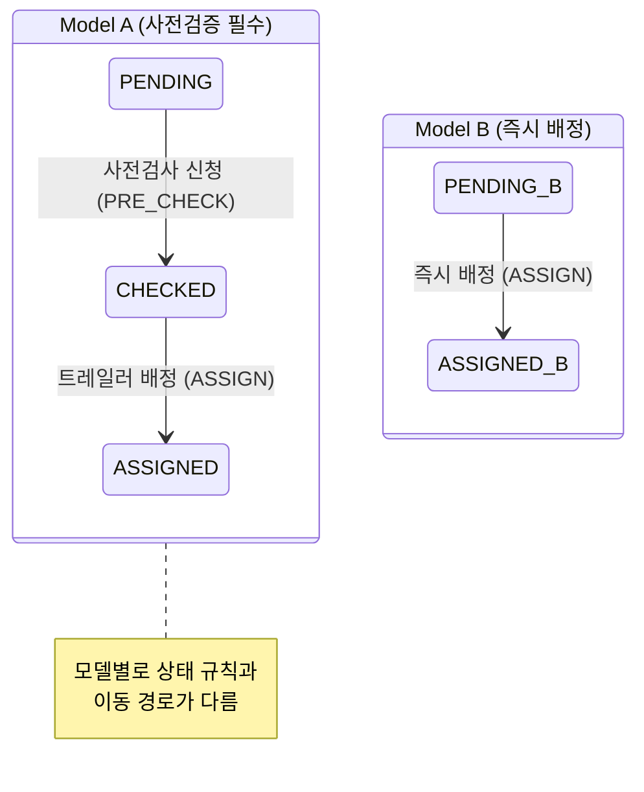

프로젝트를 진행하며 화면 기획서에 "이 상태일 때는 이 버튼이 노출되고 클릭 시 이 동작을 해야 한다"와 같은 조건들이 점점 채워지다 보면, 프론트엔드 코드 내부는 이를 분기하기 위한 복잡한 Boolean 플래그와 조건문으로 뒤덮이기 쉽습니다.

특히 **전기차 충전용 트레일러 예약 및 관제 시스템**을 개발할 당시, 관리자 화면에서 이 문제가 가장 심각했습니다. 예약 상태에 따라 오퍼레이터가 수행해야 하는 액션의 종류, 화면상 버튼 명칭, 그리고 클릭 시 API 호출 규칙이 전부 제각각이었기 때문입니다.

처음에는 단순한 if-else문으로 이 상태를 제어했지만, 서비스 대상 차량 모델이 늘어남에 따라 조건문 분기가 걷잡을 수 없이 꼬이는 위기를 마주했습니다. 이를 극복하기 위해 **유한 상태 머신(FSM, Finite State Machine)**의 개념을 도입해 스파게티 코드를 깔끔하게 리팩토링한 경험을 소개합니다.

---

### 문제 상황: 차종 증가와 예약 단계의 파편화

관제 화면의 각 예약 카드에는 상태에 따라 오퍼레이터가 눌러야 하는 액션 버튼들이 노출되어야 했습니다. 문제는 **연결할 차량의 종류에 따라 거쳐야 하는 예약의 라이프사이클(단계)이 세부적으로 달랐다**는 점이었습니다.

- **예약 모델 A (예: 사전 검사 필수 차량)**: `대기(Pending)` &rarr; `사전검사 신청(Pre-checked)` &rarr; `트레일러 배정(Assigned)` &rarr; `이동 중` &rarr; `충전 중`
- **예약 모델 B (예: 즉시 배정 차량)**: `대기(Pending)` &rarr; `트레일러 배정(Assigned)` &rarr; `이동 중` &rarr; `충전 중` (사전 검사 생략 가능)
- **예약 모델 C**: 특정 안전 센서 부착을 먼저 승인받아야 배정 단계로 갈 수 있는 특수 차량 흐름
  등
  <br/>
  이러한 비즈니스 조건들을 화면 컴포넌트 내부에 단순 조건문으로 녹여내다 보니 다음과 같은 스파게티 코드가 탄생했습니다.

```javascript
// 🍝 차종과 상태가 늘어날수록 컴포넌트가 비대해지고 버그가 생기기 쉬운 구조
function ReservationActionButtons({ reservation }) {
  const { status, carModel } = reservation;

  const handleAction = () => {
    if (status === "PENDING") {
      if (carModel === "Model_A") {
        // Model_A 전용 사전 검사 API 호출
      } else if (carModel === "Model_C") {
        // Model_C 전용 안전 센서 승인 요청 API 호출
      } else {
        // 일반 예약 승인 및 배정 API 호출
      }
    } else if (status === "ASSIGNED") {
      if (carModel === "Model_B") {
        // 바로 충전 개시 API 호출
      } else {
        // 일반 트레일러 이동 명령 API 호출
      }
    }
    // ... 하단으로 이어지는 수많은 중첩 if-else 분기
  };

  return (
    <div className="button-group">
      {status === "PENDING" && (
        <button onClick={handleAction}>
          {carModel === "Model_A"
            ? "사전검사 신청"
            : carModel === "Model_C"
              ? "안전 센서 승인요청"
              : "예약 승인"}
        </button>
      )}
      {status === "ASSIGNED" && (
        <button onClick={handleAction}>
          {carModel === "Model_B" ? "충전 개시" : "트레일러 이동"}
        </button>
      )}
    </div>
  );
}
```

지원하는 모델의 종류가 늘어날 때마다 `ReservationActionButtons` 컴포넌트의 안쪽 코드뿐만 아니라 클릭 이벤트 핸들러(`handleAction`)의 수십 줄에 달하는 if-else문을 매번 직접 뜯어고쳐야 했습니다. 이는 코드를 읽기 어렵게 만들었을 뿐만 아니라, 엉뚱한 차종에서 잘못된 버튼이 노출되는 등의 배포 후 버그로 직결되었습니다.

---

### 해결책: FSM(유한 상태 머신) 기반의 설정 분리

이 문제를 해결하기 위해, 컴포넌트가 직접 어떤 버튼을 그릴지 복잡하게 연산하지 않고 **"현재 차종 모델과 예약 상태를 키값으로 주면, 노출할 버튼 목록과 그에 따른 행동 명세(API)를 즉시 반환해 주는 상태 머신 테이블"**을 구성하기로 했습니다.

#### FSM 전이 및 액션 구조 정의



각 모델이 어떤 상태를 가질 수 있고, 그 상태에서 어떤 이벤트가 발생했을 때 다음 상태(`next`)로 가는지, 화면상 버튼의 라벨(`label`)은 무엇인지, 그리고 호출할 API(`api`)는 무엇인지를 한곳에 모아 명세화했습니다.

---

### 상태 머신을 적용한 코드 리팩토링

#### 1. FSM 설정 테이블 구축 (`reservationFsm.ts`)

```javascript
// 🟢 차량 모델별 예약 상태 전이 및 액션 정의
export const RESERVATION_FSM = {
  Model_A: {
    PENDING: {
      PRE_CHECK: {
        next: "CHECKED",
        label: "사전검사 신청",
        api: api.requestPreCheck,
      },
    },
    CHECKED: {
      ASSIGN: {
        next: "ASSIGNED",
        label: "트레일러 배정",
        api: api.assignTrailer,
      },
    },
    ASSIGNED: {
      START_CHARGE: {
        next: "CHARGING",
        label: "충전 시작",
        api: api.startCharge,
      },
    },
  },
  Model_B: {
    // Model_B는 사전 검증 없이 바로 배정으로 전이
    PENDING: {
      ASSIGN: { next: "ASSIGNED", label: "즉시 배정", api: api.assignTrailer },
    },
    ASSIGNED: {
      START_CHARGE: {
        next: "CHARGING",
        label: "충전 시작",
        api: api.startCharge,
      },
    },
  },
  Default: {
    PENDING: {
      ASSIGN: { next: "ASSIGNED", label: "예약 승인", api: api.assignTrailer },
    },
  },
};
```

#### 2. 컴포넌트 리팩토링 (`ReservationActionButtons.tsx`)

FSM 설정 덕분에 컴포넌트는 차종이나 상태가 백 개로 늘어나더라도 단 한 줄의 조건문도 없이 동적이고 견고하게 동작하는 코드로 탈바꿈했습니다.

```javascript
import { RESERVATION_FSM } from "./reservationFsm";

function ReservationActionButtons({ reservation, onUpdate }) {
  const { id, status, carModel } = reservation;

  // 1. 해당 차량 모델 및 현재 예약 상태에 맞는 가용 액션 규칙 조회
  const modelRules = RESERVATION_FSM[carModel] || RESERVATION_FSM["Default"];
  const allowedActions = modelRules[status] || {}; // 예: { PRE_CHECK: { next: 'CHECKED', label: '사전검사 신청', api: ... } }

  return (
    <div className="action-buttons-group">
      {/* 2. 조건문 없이 허용된 액션 배열을 순회하여 버튼을 동적으로 렌더링 */}
      {Object.entries(allowedActions).map(([actionKey, actionSpec]) => (
        <button
          key={actionKey}
          className={`btn-${actionKey.toLowerCase()}`}
          onClick={async () => {
            try {
              // 3. 약속된 API 동작 호출
              await actionSpec.api(id);
              // 4. API 성공 시 다음 상태값(next)으로 예약 상태 업데이트
              onUpdate(actionSpec.next);
            } catch (err) {
              alert("액션 수행 중 오류가 발생했습니다.");
            }
          }}
        >
          {actionSpec.label}
        </button>
      ))}
    </div>
  );
}
```

---

### FSM 도입이 가져다준 성과

1. **컴포넌트 렌더링 로직의 단순화**
   - 컴포넌트 내부에서 if-else 분기가 100% 제거되었으며, 단지 FSM 테이블의 출력 결과를 받아 그대로 맵핑하여 렌더링하는 역할로 단순해졌습니다.
2. **비즈니스 정책과 UI의 격리**
   - "이 차종은 사전 검증을 거쳐야 배정된다"라는 엄격한 비즈니스 규칙이 코드 깊숙한 곳의 렌더링 로직이 아닌 `reservationFsm.ts`라는 설정 파일에 깔끔하게 격리되었습니다.
3. **확장성 (신규 차종 대응)**
   - 나중에 새로운 타입의 차량이나 특수한 프로세스를 가진 차종이 추가되더라도, 공통 UI 코드인 `ReservationActionButtons.tsx`는 단 한 자도 건드리지 않고 `reservationFsm.ts` 파일에 새로운 객체 하나만 정의해 줌으로써 완벽히 대응할 수 있게 되었습니다.
