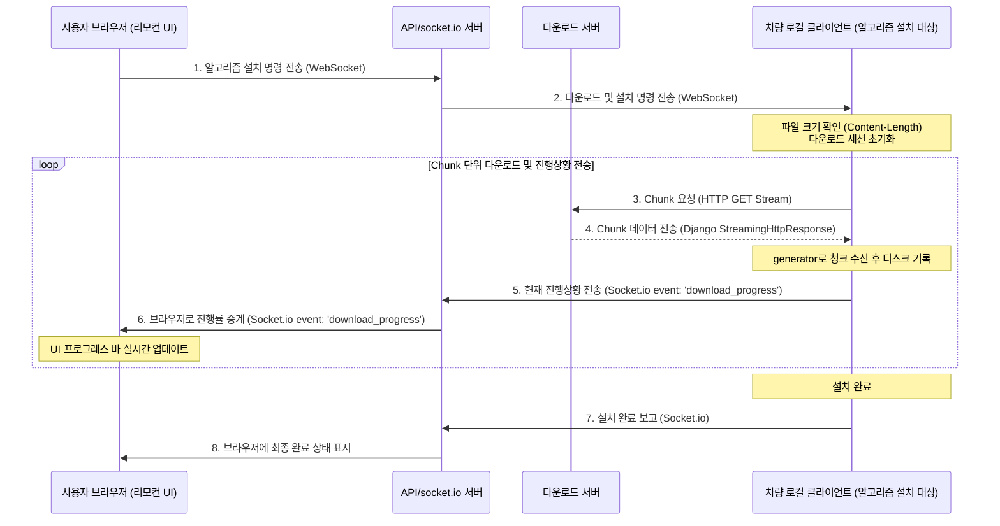

원격지 기기를 제어하고 모니터링하는 서비스를 개발하면서, 8GB가 넘는 대용량 모델 파일을 기기에 원격으로 전송하여 설치해야 하는 과제가 있었습니다. 이 과정에서 서버와 기기의 메모리가 초과되는 문제(OOM)를 겪었고, 사용자가 브라우저에서 전송 진행 상황을 실시간으로 확인하기도 어려웠습니다. 이를 해결하기 위해 **전용 다운로드 서버 분리, 청크 단위의 분할 다운로드, 그리고 Socket.io를 이용한 실시간 진행률 중계**를 조합하여 안정적으로 극복한 과정을 정리해 보았습니다.

---

### 기존 방식의 문제점과 한계: 늘어난 용량과 네트워크 먹통

초기에는 다운로드할 파일 크기가 그리 크지 않았습니다. 그래서 일반적인 API 서버가 파일을 통째로 메모리에 올려 한번에 브라우저나 단말로 응답을 내려주도록 단순하게 구현해 사용했습니다. 하지만 요구사항이 변경되어 대용량 파일도 서빙하게 되면서 다음과 같은 심각한 문제가 자주 발생하기 시작했습니다.

1. **메모리 초과(OOM) 현상**:
   기가바이트 단위의 파일을 읽어 들일 때마다 서버와 차량 단말 PC의 메모리가 순간적으로 급증했습니다. 차량 단말 PC는 일반 컴퓨터에 비해 메모리 자원이 여유롭지 않아 프로세스가 강제 종료되는 현상이 잦았습니다.
2. **서버의 네트워크 대역폭 독점**:
   대용량 다운로드가 시작되면 서버가 가진 네트워크 대역폭을 다운로드 응답 하나가 모두 차지해 버렸습니다. 이로 인해 실시간 차량 관제 데이터나 명령 전송 같은 정작 중요한 다른 일반 API 응답들이 전송될 자리가 부족해져, 서비스 전체에 타임아웃이나 응답 지연 현상이 발생했습니다.
3. **원격 제어 진행 상황 모니터링 불가**:
   브라우저는 차량에 명령을 전달하는 '원격 리모컨' 역할을 수행할 뿐이지만, 차량이 다운로드를 마칠 때까지 다운로드가 제대로 진행되고 있는지 화면에서 전혀 알 수 없어 운영자가 상태를 파악하기 어려웠습니다.

---

### 주어진 제약 조건: 퍼블릭 스토리지 제한과 비용

파일 전송 문제를 해결하기 위해 외부 클라우드 스토리지(S3 등)에 업로드한 뒤 다운로드받는 방법은 선택할 수 없었습니다.

- **보안 정책**: 자율주행 핵심 알고리즘 파일은 사내 보안 정책으로 인해 외부 퍼블릭 클라우드에 저장하거나 올릴 수 없는 상황이었습니다.
- **네트워크 전송 비용**: 8GB 규모의 대용량 데이터를 여러 차량이 반복해서 받아 갈 때 발생하는 막대한 외부 트래픽 비용을 아끼기 위해 반드시 사내 온프레미스 인프라를 활용해야 했습니다.

---

### 아키텍처 설계: 서버 분리와 최대 대역폭 제한

이 문제를 근본적으로 해결하기 위해 **서버를 역할별로 분리**하고, **대역폭 제한**을 두었습니다.



1. **다운로드 전용 서버의 분리**: 메인 비즈니스 로직을 수행하는 API 서버에 부하를 주지 않도록 파일 서빙 기능만을 담당하는 독립된 다운로드 전용 서버를 구축했습니다.
2. **최대 네트워크 대역폭 제한**: 다운로드 서버가 온프레미스 망의 모든 트래픽 대역폭을 잠식하지 않도록, 해당 서버에 허용되는 **최대 다운로드 전송 속도(대역폭)를 적절한 선으로 제한**해 두었습니다. 덕분에 여러 기기가 동시에 배포 파일을 받아 가도 메인 서버의 실시간 통신이나 다른 인터넷 망 사용에 영향이 가지 않도록 방어 장치를 마련했습니다.
3. **청크 스트리밍과 실시간 중계**: 파일을 청크 단위로 나누어 스트리밍 전송하고, 차량은 이를 받으면서 미리 뚫려있던 Socket.io 라인을 통해 브라우저에 진행 상황을 실시간으로 중계하는 방식으로 개선했습니다.

---

### 스트리밍과 실시간 중계 구현방식

#### 1단계: 백엔드 구현 (Django `StreamingHttpResponse`)

다운로드 전용 서버는 Python/Django 기반으로 구축되어 있었습니다. 대용량 파일을 한 번에 메모리에 올리지 않고 쪼개어 응답하도록 제너레이터를 사용해 `StreamingHttpResponse`를 구성했습니다.

```python
# download_server/views.py
import os
from django.http import StreamingHttpResponse, Http404
from django.shortcuts import get_object_or_404
from .models import AlgorithmPackage

def file_chunk_generator(file_path, chunk_size=1024 * 64):
    """파일을 지정한 버퍼 크기(64KB)만큼 끊어서 읽는 제너레이터"""
    with open(file_path, 'rb') as f:
        while True:
            chunk = f.read(chunk_size)
            if not chunk:
                break
            yield chunk

def serve_package_file(request, package_id):
    package = get_object_or_404(AlgorithmPackage, id=package_id)
    file_path = package.file_path

    if not os.path.exists(file_path):
        raise Http404("파일이 존재하지 않습니다.")

    file_size = os.path.getsize(file_path)

    response = StreamingHttpResponse(
        file_chunk_generator(file_path),
        content_type='application/octet-stream'
    )

    response['Content-Disposition'] = f'attachment; filename="{package.filename}"'

    # 🌟 중요: 차량 클라이언트가 파일 전체 크기를 알고 진행률(%)을 연산할 수 있도록 설정
    response['Content-Length'] = str(file_size)

    return response
```

<small style="opacity: 0.65; display: block; margin-top: 5px; font-size: 0.85em;">\* 위 코드는 이해를 돕기 위해 로직을 단순화하여 작성한 예시 코드로, 실제 동작과는 약간의 차이가 있을 수 있습니다.</small>

---

#### 2단계: 차량 클라이언트 구현 (Generator 기반 청크 다운로드 및 Progress 발송)

차량에서 기동하는 클라이언트 다운로드 스크립트는 `requests` 라이브러리의 `stream=True` 옵션을 활성화해 응답 데이터를 제너레이터 형태로 청크 단위로 읽어 디스크에 바로 쓰도록 하였습니다. 이를 통해 차량의 메모리 사용량을 항상 안전한 수준(예: 수십 MB 이하)으로 묶어둘 수 있었습니다.

```python
# vehicle_client/installer.py
import requests
import socketio

# 메인 API 서버의 실시간 통신망 소켓 클라이언트 연결
sio = socketio.Client()
sio.connect('http://main-api-server:8000')

def download_and_install_module(download_url, save_path, vehicle_id):
    # stream=True로 바디 데이터를 한 번에 로드하지 않고 스트림 유지
    response = requests.get(download_url, stream=True)
    total_size = int(response.headers.get('content-length', 0))

    if total_size == 0:
        print("전체 파일 크기를 식별할 수 없습니다.")
        return

    received_size = 0

    # iter_content 제너레이터로 64KB씩 다운로드받으며 곧바로 디스크 쓰기 진행
    with open(save_path, 'wb') as f:
        for chunk in response.iter_content(chunk_size=1024 * 64):
            if chunk:
                f.write(chunk)
                received_size += len(chunk)

                # Socket.io 이벤트를 통해 실시간 진행 상태 전송
                progress = int((received_size / total_size) * 100)
                sio.emit('progress', {
                    'progress': progress,
                    'status': 'downloading'
                })

    # 다운로드 완료 상태 보고
    sio.emit('progress', {
        'progress': 100,
        'status': 'completed'
    })
```

<small style="opacity: 0.65; display: block; margin-top: 5px; font-size: 0.85em;">\* 위 코드는 이해를 돕기 위해 로직을 단순화하여 작성한 예시 코드로, 실제 동작과는 약간의 차이가 있을 수 있습니다.</small>

---

#### 3단계: 브라우저 (리모컨) React 컴포넌트

브라우저는 원격 제어 UI로서 메인 API 서버가 중계해주는 `download_progress` 이벤트를 리스닝하여 프로그레스 바를 사용자에게 동적으로 제공합니다.



```jsx
// browser_src/components/Installer.jsx
import React, { useState, useEffect } from "react";
import { io } from "socket.io-client";

// 메인 API 서버 소켓 연결
const socket = io("http://main-api-server:8000");

export default function Installer({ vehicleId, algorithmId }) {
  const [status, setStatus] = useState("idle"); // idle, downloading, completed
  const [progress, setProgress] = useState(0);

  useEffect(() => {
    // 차량 진행 상황 실시간 감지
    socket.on("download_progress", (data) => {
      if (data.vehicleId === vehicleId) {
        setProgress(data.progress);
        if (data.status === "downloading") setStatus("downloading");
        if (data.status === "completed") setStatus("completed");
      }
    });

    return () => {
      socket.off("download_progress");
    };
  }, [vehicleId]);

  const handleInstallClick = () => {
    setStatus("downloading");
    setProgress(0);

    // 메인 서버를 경유하여 차량 단말에 설치 시작 명령 전송
    socket.emit("trigger_install", { vehicleId, algorithmId });
  };

  return (
    <div className="installer-card">
      <button
        onClick={handleInstallClick}
        disabled={status === "downloading"}
        className="btn-primary"
      >
        {status === "downloading"
          ? "차량 다운로드 중..."
          : "알고리즘 원격 배포 시작"}
      </button>

      {status === "downloading" && (
        <div className="progress-container">
          <div className="progress-bar-bg">
            <div
              className="progress-bar-fill"
              style={{ width: `${progress}%` }}
            />
          </div>
          <span className="progress-label">차량 설치 완료율: {progress}%</span>
        </div>
      )}

      {status === "completed" && (
        <p className="success-txt">차량 내 알고리즘 배포 완료!</p>
      )}
    </div>
  );
}
```



<small style="opacity: 0.65; display: block; margin-top: 5px; font-size: 0.85em;">\* 위 코드는 이해를 돕기 위해 로직을 단순화하여 작성한 예시 코드로, 실제 동작과는 약간의 차이가 있을 수 있습니다.</small>

---

### 결과

이 아키텍처 개선을 통해 대용량 파일 설치 작업의 품질과 안정성을 향상시켰습니다.

- **메모리 과부하 해결**:
  차량 디바이스 측에서 청크 단위 데이터 스트림 다운로드와 디스크에 바로 쓰는 방식을 채택하여 기기 메모리가 폭증하지 않고 최저 수준을 일정하게 유지함으로써 OOM 오류를 해결할 수 있었습니다.
- **안정적인 서비스 대역폭 확보**:
  다운로드 서버의 역할을 물리적으로 완전히 격리하고 해당 서버의 **최대 네트워크 대역폭 제한**을 설정함으로써, 파일 전송량이 치솟더라도 다른 서비스의 API가 느려지거나 먹통이 되지 않도록 개선하였습니다.
- **진정한 의미의 원격 모니터링 UX 구현**:
  브라우저는 대용량 파일을 수신하지 않으면서도, 차량 단말이 `socket.io` 채널을 통해 보내오는 전송 상태를 수신해 바를 표시함으로써 사용자가 현재 상황을 실시간으로 알 수 있도록 개선하였습니다.
- **비용 절감 및 보안 유지**:
  온프레미스 내부에 다운로드 서버를 분리함으로써 보안 규정을 준수하고, 추가적인 클라우드 유지 비용 문제를 해결할 수 있었습니다.
